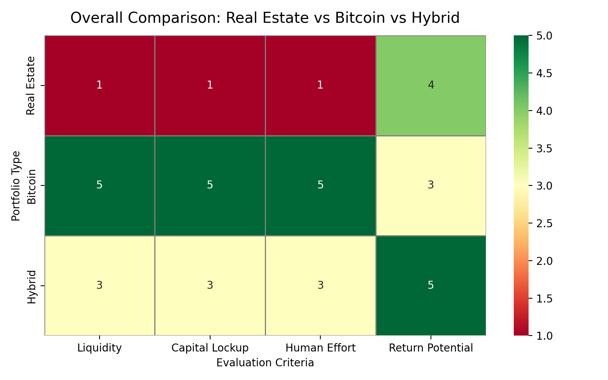
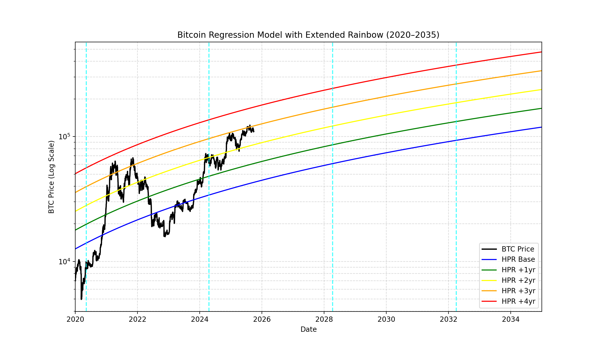
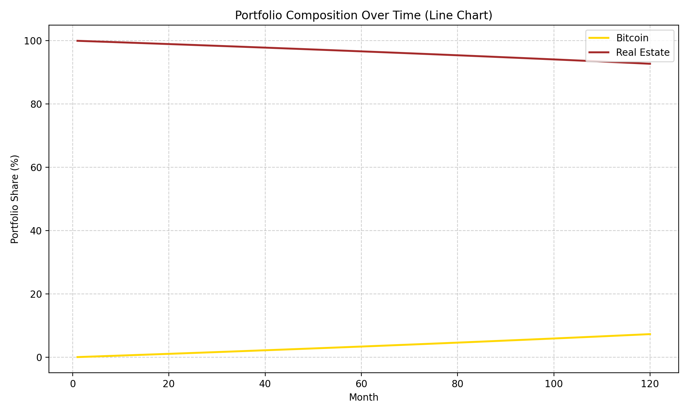
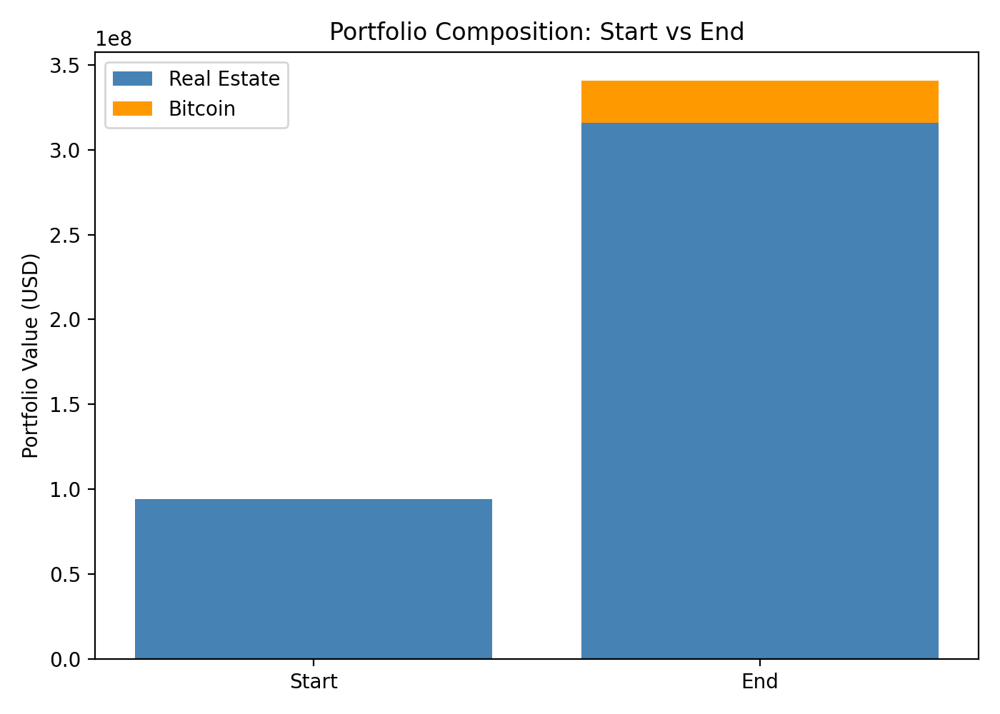
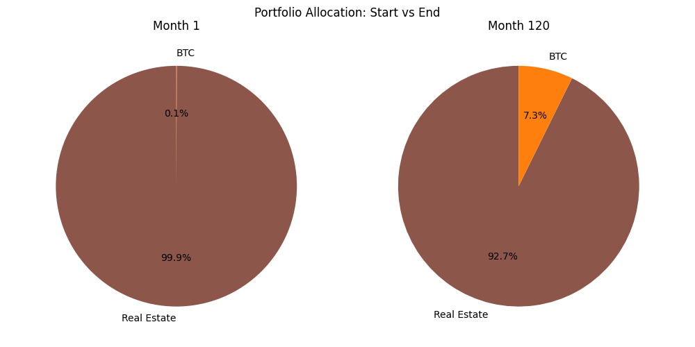
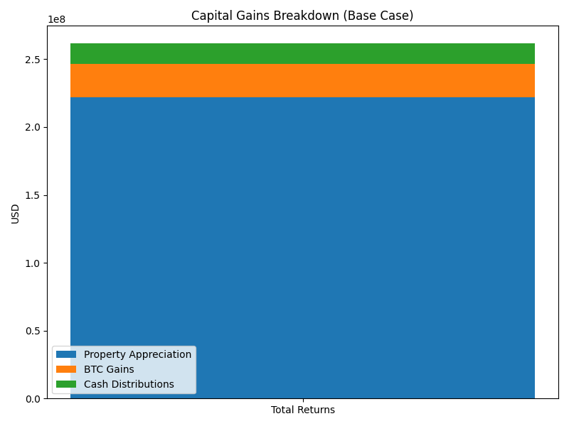
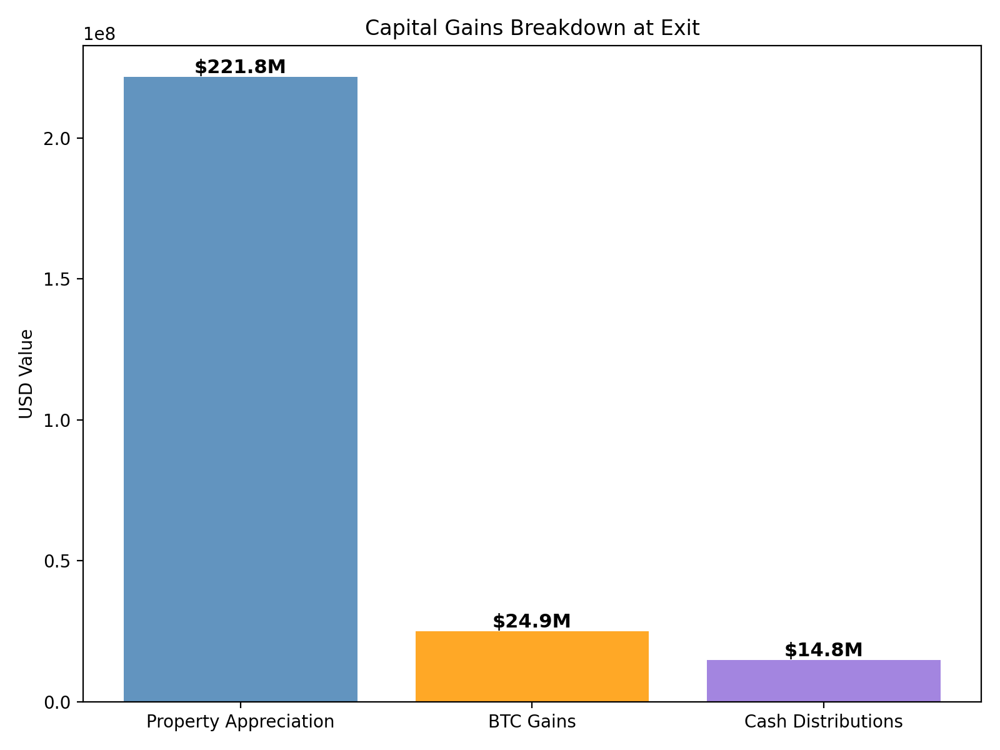

# Real Estate + Bitcoin Portfolio Analysis

This project explores Grant Cardone's strategy: using rental cash flow to accumulate Bitcoin over time. The analysis compares three strategies:

- **Real Estate Only** — capital-intensive, labor- and overhead-heavy, but stable  
- **Bitcoin Only** — highly liquid, minimal labor, but volatile  
- **Hybrid (Real Estate + Bitcoin)** — combines both, aiming for upside with stability  

---

## 1. Overall Comparison (Portfolio Framework)

This heatmap (`overall.png`) provides a high-level comparison of the three strategies across **Liquidity**, **Capital Lockup**, **Human Effort**, and **Return Potential**.

| Metric          | Real Estate | Bitcoin | Hybrid |
|-----------------|-------------|---------|--------|
| Liquidity       | Low         | High    | Moderate |
| Capital Lockup  | High        | Minimal | Medium |
| Human Effort    | High        | Low     | Moderate |
| Return Potential| Strong, linear | Convex, volatile upside | Highest balance |

On a 1–5 scale, Bitcoin wins on liquidity and effort, Real Estate wins on stability, while the Hybrid balances both — leveraging liquidity and capital productivity for asymmetric upside.

## 2. Bitcoin Regression & Halving Overlay

Chart: `btc_regression.png`

- Logarithmic regression bands (the "rainbow") extend through 2035.  
- BTC price oscillates around these curves, often overshooting during hype cycles.  
- Vertical dashed lines show halving dates, anchoring the supply-driven narrative.  
- Extending the rainbow highlights potential future trajectories and helps contextualize BTC's asymmetric upside in the hybrid model.  

## 3. Portfolio Composition Over Time

### 3.a Line Chart View (`portfolio_comp.png`)
- Clean line chart showing evolving weight of property vs BTC in the portfolio
- Real estate dominates early, but BTC grows more significant as compounding kicks in
- Supports the thesis: even modest BTC allocations become impactful over time

### 3.b Stacked Area Chart View (`portfolio_comp_alt.png`)
- Alternative visualization showing the same data as normalized stacked areas
- Areas always add to 100%, emphasizing the relative allocation changes
- Provides a different perspective on portfolio composition evolution

> **Visualization Options**: The `portfolio_comp.py` script supports two modes:
> - `mode="line"` (default): Clean line chart for precise tracking
> - `mode="stacked"`: Normalized stacked area chart for relative allocation view

## 4. Portfolio Allocation: Start vs End

Chart: `portfolio_pie.png`

- Comparing Month 1 and Month 120 allocation percentages
- Initially, the portfolio is nearly 100% real estate
- By Month 120, Bitcoin has grown to ~7–10% under base case assumptions
- Shows the power of compounding even with modest BTC allocations

## 5. Capital Gains Breakdown

### 5.a Proportional Contribution (`cap_breakdown.png`)  
Horizontal stacked bar chart showing **Property Appreciation**, **BTC Gains**, and **Cash Distributions** as proportions of total gains.

### 5.b Absolute Value at Exit (`capital_breakdown.png`)  
Vertical bar chart of absolute dollar contributions, emphasizing:  
- Real estate appreciation dominates in sheer size.  
- BTC still adds meaningful upside.  
- Cash distributions underperform compared to appreciating assets.

## 6. Base Case Summary Metrics
These are the outputs from the base case (10% BTC growth, 10-year hold period):

- **Equity Investment**: $94,000,000
- **Final Property Value**: $315,820,349
- **Final BTC Value**: $24,877,999
- **Sale Proceeds**: $174,820,349
- **IRR**: 8.68%
- **NPV**: $38,891,861

### 6.b Capital Gains Breakdown (Base Case)
- **Property Appreciation**: $221,820,349
- **BTC Gains**: $24,877,999
- **Cash Distributions**: $14,818,800
- **Total Value at Exit**: $214,517,148
- **Net Gain (Total – Equity Investment)**: $120,517,148

## 7. Halving Scenario Metrics
Here we compare outcomes under the HPR (Halving Price Regression) model:

| Scenario | IRR | NPV | Final BTC Value |
|----------|-----|-----|-----------------|
| Blue | 8.18% | $32,784,307 | $3,904 |
| Green | 8.18% | $32,784,307 | $7,808 |
| Yellow | 8.18% | $32,784,307 | $15,617 |
| Red | 8.18% | $32,784,307 | $62,467 |

## 8. Key Findings

- **Real Estate** → stable but capital-locked, labor-intensive.  
- **Bitcoin** → liquid, low-effort, convex upside but volatile.  
- **Hybrid** → enhances IRR & NPV by blending the two.  

BTC gains exceeded cash distributions — showing liquidity in USD terms underperforms vs appreciating assets. Even conservative BTC assumptions improved modeled returns.

➡️ **Takeaway**: A hybrid allocation balances the **security of property** with the **convexity of Bitcoin**, producing stable returns with asymmetric upside.

## 9. Glossary of Financial Metrics
**IRR (Internal Rate of Return):** The annualized rate of return at which the net present value (NPV) of all future cash flows equals zero. In other words, it's the effective yearly return considering both the size *and* timing of cash flows. Useful for comparing projects.

**NPV (Net Present Value):** The dollar value today of all expected future cash flows (rents, distributions, property sale, Bitcoin liquidation), discounted back at a chosen rate (e.g., loan interest or required return). A positive NPV means the project creates value above its cost of capital.

👉 *Quick takeaway:* IRR tells you the % return. NPV tells you the $ value created today. Both help investors judge if the Real Estate + Bitcoin strategy is attractive.
